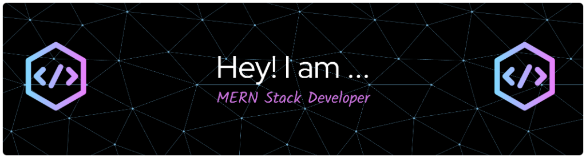

  

<h1 align="center">Hi, I'm Suraya Afroze 👋</h1>

<h3 align="center">💻 MERN Stack Developer | Transforming complex ideas into interactive, responsive, and visually stunning web experiences. 🚀</h3>

  

## 📌 About Me
- 🔭 **Current Focus:** Developing interactive, user-centric, and optimized web applications.
- 🌱 **Learning & Growth:** Deep-diving into full-stack MERN development, backend architectures, and database optimizations.
- 💬 **Ask me about:** HTML, CSS, JavaScript, React, Tailwind CSS, and Responsive Web Design.
- 📫 **Connect with me:** [surayaafroze63@gmail.com](mailto:surayaafroze63@gmail.com)
- 👨‍💻 **Portfolio & Projects:** Explore my work on my [Portfolio Website](https://porfolio-three-plum.vercel.app/)
- ⚡ **Fun Fact:** I believe that writing clean, readable code is just as creative and important as crafting beautiful UI designs.

## 🧠 Focus Areas

- 🚀 **Full-Stack MERN Development** — Building interactive, end-to-end web applications with Express, Node.js, and MongoDB.
- ⚛️ **React Engineering** — Structuring state management, custom hooks, and context APIs for maximum performance.
- 🧩 **Modular Components** — Creating highly reusable, clean, and scalable frontend UI components.
- 🧼 **Clean Code Architecture** — Adhering to strict DRY principles, industry standards, and solid design patterns.
- 🧠 **Analytical Problem Solving** — Designing secure routing, rigorous validation (Zod), and robust business logic.

<h2 align="center"> Languages & Tools</h2>

  
  
  
  
  
  
  
  
  
  
  
  
  
  

<h2 align="center"> 📊 GitHub Stats</h2>

  

  
  
<pre>  
const developer = {
  name: "Suraya Afroze",
  role: "MERN Stack Developer",
  passion: "Building interactive, accessible & high-performance web applications",
  techStack: {
    frontend: ["React.js", "Next.js", "Tailwind CSS", "JavaScript (ES6+)"],
    backend: ["Node.js", "Express.js", "MongoDB"],
    utilities: ["TypeScript", "Zod", "RESTful APIs"]
  },
  tools: ["Git", "GitHub", "Figma", "Vercel", "Netlify", "Postman"],
  mission: "Transforming complex ideas into seamless user experiences",
  philosophy: "Writing clean, standard-compliant, and dry code daily"
};
</pre>  

